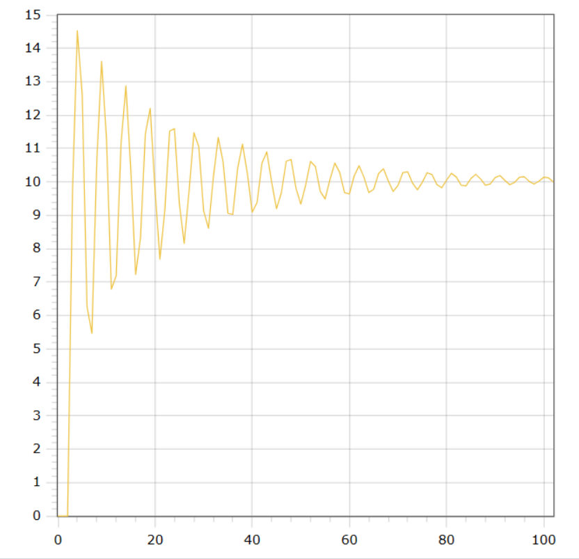

<p align="center"> Министерство образования Республики Беларусь</p>
<p align="center">Учреждение образования</p>
<p align="center">“Брестский Государственный технический университет”</p>
<p align="center">Кафедра ИИТ</p>
<br><br><br><br><br><br><br>
<p align="center">Лабораторная работа №1</p>
<p align="center">По дисциплине “Общая теория интеллектуальных систем”</p>
<p align="center">Тема: “Моделирования температуры объекта”</p>
<br><br><br><br><br>
<p align="right">Выполнил:</p>
<p align="right">Студент 2 курса</p>
<p align="right">Группы ИИ-25</p>
<p align="right">Дулько Д.А</p>
<p align="right">Проверил:</p>
<p align="right">Ситковец Я.С.</p>
<br><br><br><br><br>
<p align="center">Брест 2024</p>

---

# Общее задание #
1. Написать отчет по выполненной лабораторной работе №1 в .md формате (readme.md) и с помощью запроса на внесение изменений (**pull request**) разместить его в следующем каталоге: **trunk\ii0xxyy\task_02\doc** (где **xx** - номер группы, **yy** - номер студента, например **ii02102**).
2. Исходный код написанной программы разместить в каталоге: **trunk\ii0xxyy\task_02\src**.

# Задание #
На C++ реализовать программу, моделирующую рассмотренный выше ПИД-регулятор.  В качестве объекта управления использовать математическую модель, полученную в предыдущей работе.
В отчете также привести графики для разных заданий температуры объекта, пояснить полученные результаты.

---

# Выполнение задания #

Код программы:
```C++
#include <iostream>
#include <cmath>
#include <vector>
#include <fstream>

using namespace std;

class NonlinearSystem {
private:
    double coeff_K = 0.0001;
    double time_const = 100.0;
    double delay_time = 100.0;
    double init_time = 1.0;

    double calc_q0 = coeff_K * (1 + delay_time / init_time);
    double calc_q1 = -coeff_K * (1 + 2 * delay_time / init_time - init_time / time_const);
    double calc_q2 = coeff_K * delay_time / init_time;

    vector<double> coeffs = { calc_q0, calc_q1, calc_q2 };
    vector<double> errors = { 0, 0, 0 };
    vector<double> output_vals = { 0, 0, 0 };
    vector<double> control_vals = { 1, 1 };

    double calculateSum() {
        double result = 0.0;
        for (size_t i = 0; i < coeffs.size(); i++) {
            result += coeffs[i] * errors[i];
        }
        return result;
    }

public:
    void simulateSystem(int duration, double targetValue, double paramA = 0.5, double paramB = 0.3,
        double paramC = 0.9, double paramD = 0.7) {
        for (int step = 0; step < duration; ++step) {

            errors[0] = targetValue - output_vals[output_vals.size() - 1];
            errors[1] = targetValue - output_vals[output_vals.size() - 2];
            errors[2] = targetValue - output_vals[output_vals.size() - 3];

            control_vals[0] = control_vals[1] + calculateSum();

            double newOutput = paramA * output_vals[output_vals.size() - 1]
                - paramB * pow(output_vals[output_vals.size() - 2], 2)
                + paramC * control_vals[0]
                + paramD * sin(control_vals[1]);

            output_vals.push_back(newOutput);
            control_vals[1] = control_vals[0];
        }
    }

    const vector<double>& getOutputValues() const {
        return output_vals;
    }
};

int main() {
    double desiredValue;
    ofstream outputFile("simulation_output.txt");
    NonlinearSystem system;

    if (outputFile.is_open()) {
        cout << "Enter the target value (setpoint): ";
        cin >> desiredValue;

        system.simulateSystem(100, desiredValue);

        const vector<double>& results = system.getOutputValues();

        for (size_t index = 0; index < results.size(); ++index) {
            double scaledResult = results[index] * desiredValue / results[results.size() - 1];
            cout << index << " " << scaledResult << endl;
            outputFile << index << " " << scaledResult << endl;
        }

        outputFile.close();
    }
    else {
        cerr << "Error: Failed to open output file." << endl;
    }

    return 0;
}


```     

Вывод программы:
0 0
1 0
2 0
3 9.69141
4 14.4491
5 12.5053
6 6.31874
7 5.70483
8 10.7318
9 13.5135
10 11.0942
11 6.83138
12 7.48094
13 11.2908
14 12.7199
15 10.1472
16 7.32451
17 8.64263
18 11.5387
19 11.9865
20 9.5324
21 7.85542
22 9.45538
23 11.567
24 11.329
25 9.18304
26 8.38762
27 10.0141
28 11.4446
29 10.7728
30 9.04165
31 8.88185
32 10.373
33 11.2298
34 10.3341
35 9.05144
36 9.3107
37 10.5741
38 10.9715
39 10.0161
40 9.15944
41 9.65968
42 10.6545
43 10.7083
44 9.81041
45 9.32068
46 9.92514
47 10.6479
48 10.4678
49 9.70014
50 9.50043
51 10.1114
52 10.5842
53 10.2665
54 9.66432
55 9.67428
56 10.2281
57 10.489
58 10.112
59 9.68126
60 9.82697
61 10.2879
62 10.3823
63 10.0043
64 9.73112
65 9.95063
66 10.3041
67 10.2787
68 9.93893
69 9.79752
70 10.043
71 10.2902
72 10.1878
73 9.90823
74 9.868
75 10.1055
76 10.2576
77 10.1147
78 9.90361
79 9.93403
80 10.1422
81 10.216
82 10.0609
83 9.91669
84 9.99044
85 10.1581
86 10.1727
87 10.0253
88 9.9401
89 10.0348
90 10.1589
91 10.1327
92 10.0056
93 9.96796
94 10.0669
95 10.1494
96 10.0991
97 9.99828
98 9.99593
99 10.0875
100 10.1343
101 10.073
102 10

