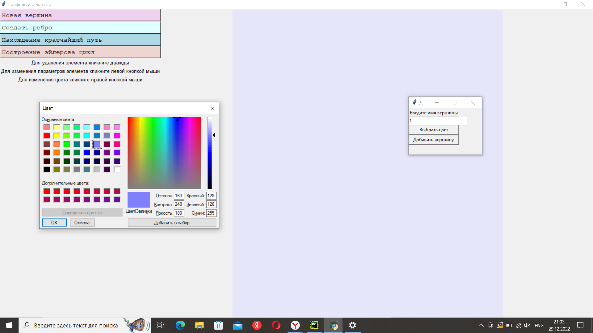
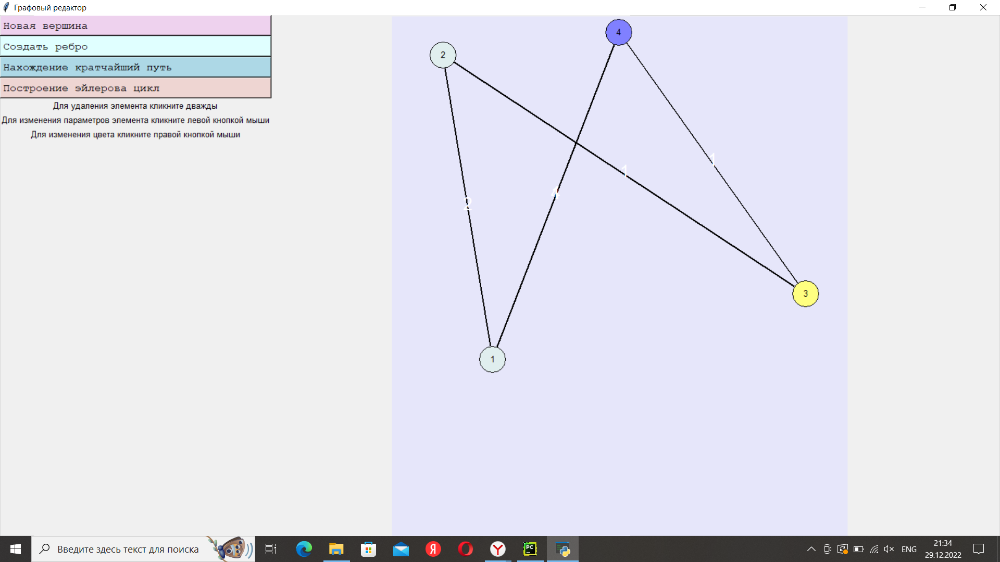
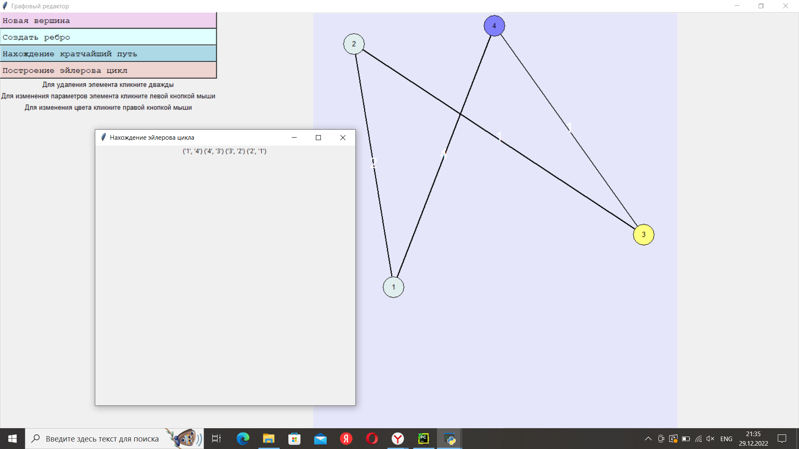
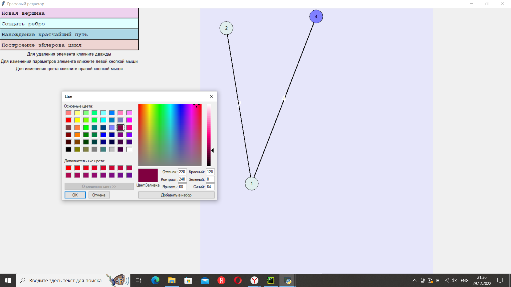

Министерство образования Республики Беларусь

Учреждение образования

«Брестский государственный технический университет»

Кафедра ИИТ

     

Лабораторная работа №3

За третий семестр

По дисциплине: «Общая теория интеллектуальных систем»

Тема: «Разработка редакторов графов»

     

Выполнила:

Студентка 2 курса

Группы ИИ-26

Заруцкий В.Я.

  

Проверил:

Ситковец Я.С.

Брест 2024  

--
# В работе было реализованно: #
1. Создание и внедрение программного решения, которое позволяет редактировать различные типы графовых структур и выполнять над ними разнообразные операции.

2. Редактор предоставляет следующие возможности:
  a) одновременная работа с несколькими графами (MDI);
  b) [*] выделение нескольких элементов графа одновременно, копирование выделенного фрагмента в буфер обмена и восстановление из него;
  c) присвоение имен графам;
  d) сохранение и восстановление графа в собственном формате программы;
  e) экспорт и импорт графа в текстовом формате (описание приведено ниже);
  f) создание, удаление, именование, переименование и перемещение узлов;
  g) создание неориентированных рёбер и их удаление;
  h) добавление, удаление и редактирование содержимого узлов (содержимое представлено текстом и ссылками на файлы);
  i) установка цвета рёбер и узлов, а также формы узлов;
  j) [*] создание и отображение петель;
  k) [*] создание и отображение множественных рёбер.

3. Программное решение позволяет выполнять следующие действия:
  a) вывод информации о графе;
  b) поиск всех путей (маршрутов) между двумя узлами, включая кратчайшие;
  c) вычисление расстояния между двумя узлами;
  d) [*] раскраска графа;
  e) нахождение Эйлеровых циклов.  

4. Отчет по выполненной лабораторной работе в .md формате (readme.md). Разместить его в следующем каталоге: **trunk\ii0xxyy\task_03\doc** (где **xx** - номер группы, **yy** - номер студента, например **ii02302**). 

5. Исходный код разработанной программы разместить в каталоге: **trunk\ii0xxyy\task_03\src**.
nk\ii0xxyy\task_04\doc.

